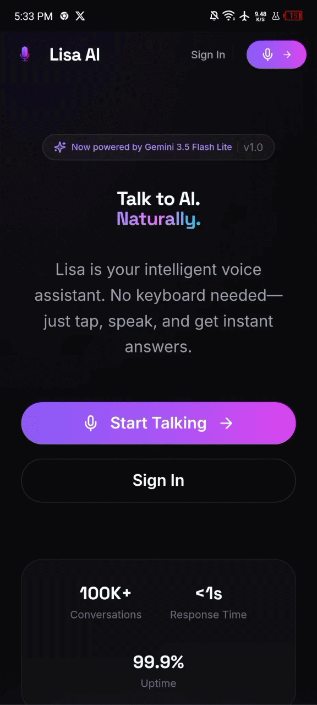

# Lisa AI — Browser Voice Assistant

A voice-controlled AI assistant built for my university internship project.

**Tech Stack:** React · Vite · TailwindCSS · Clerk · Convex · Google Gemini · ElevenLabs

---

## Demo - Desktop Devices

<p align="center">
  
</p>

## Demo - Mobile Devices

<p align="center">
  
</p>

---

## Features

- **Tap-to-Talk Mode** — Press the mic button to speak, release when done
- **Voice Responses** — Lisa speaks back with a natural female voice, using ElevenLabs
- **AI-Powered Conversations** — Smart responses powered by Google Gemini
- **Authentication** — Secure login/signup with Clerk, with a webhook that keeps user profiles in sync
- **Responsive Design** — Works on mobile and desktop

---

## Quick Start

```bash
# Install
npm install

# Set environment variables (see .env.example)
cp .env.example .env.local

# Run dev server
npm run dev

# Run Convex backend (another terminal)
npm run convex:dev
```

**Visit:** `http://localhost:5173`

---

## Environment Variables

```env
# Required
VITE_PUBLIC_CLERK_PUBLISH_KEY=pk_test_...
CLERK_SECRET_KEY=sk_test_...
GEMINI_API_KEY=...

# Required for Clerk JWT verification
CLERK_JWT_ISSUER_DOMAIN=https://your-app.clerk.accounts.dev

# Auto-generated by Convex (do not edit – filled by `npx convex dev`)
CONVEX_DEPLOYMENT=
VITE_CONVEX_URL=
VITE_CONVEX_SITE_URL=

# Optional
ELEVENLABS_API_KEY=...
CLERK_WEBHOOK_SECRET=whsec_...
```

Get keys from:
- [Clerk Dashboard](https://dashboard.clerk.com) → API Keys, and Webhooks tab for the signing secret
- [Google AI Studio](https://aistudio.google.com) → Get API Key
- [ElevenLabs](https://elevenlabs.io) → free account → API key 

Backend secrets (everything except the `VITE_` prefixed key) are read by
Convex functions, not the frontend — set them against your deployment
with `npx convex env set KEY value` if they don't get picked up from
`.env.local` automatically.

---

## How It Works

### Tap-to-Talk Flow

```
1. Tap microphone button → Start conversation
2. Tap mic again → Start listening
3. Speak your message
4. Lisa processes & responds (voice + text)
5. Tap mic again for next message
6. Press End Call when done
```

---

## Project Structure

```
lisa-ai/
├── src/
│   ├── pages/
│   │   ├── CallPage.jsx       # Main voice assistant ⭐
│   │   ├── SettingsPage.jsx   # Settings & logout
│   │   ├── LandingPage.jsx    # Public landing page
│   │   ├── SignInPage.jsx     # Login
│   │   └── SignUpPage.jsx     # Register
│   ├── providers/             # Auth + DB providers
│   ├── App.jsx                # Router setup
│   └── main.jsx               # Entry point
├── convex/
│   ├── ai.ts                  # Gemini AI integration
│   ├── tts.ts                 # ElevenLabs text-to-speech (optional)
│   ├── http.ts                # Clerk webhook route (optional)
│   ├── clerkWebhook.ts        # Clerk webhook handlers
│   ├── conversations.ts       # Conversation CRUD
│   ├── messages.ts            # Message CRUD
│   ├── userSettings.ts        # Per-user preferences
│   ├── users.ts               # User profile queries/mutations
│   ├── auth.ts                # Shared auth helpers
│   └── schema.ts              # Database schema
└── public/
    └── favicon.png            # Custom app icon
```

---

## Tech Stack Details

| Technology | Version | Use Case |
|------------|---------|----------|
| React | 18.3+ | UI Components |
| Vite | 5.4+ | Build Tool |
| Tailwind CSS | 3.4+ | Styling |
| Framer Motion | 11.5+ | Animations |
| Clerk | 5.7+ | Authentication |
| Convex | 1.14+ | Backend/Database |
| Gemini 3.5 Flash Lite | - | AI Model |
| ElevenLabs | free tier | TTS (voice), with browser TTS fallback |
| Web Speech API | - | Speech Recognition & TTS fallback |

---

## Pages & Routes

| Route | Page | Description |
|-------|------|-------------|
| `/` | Landing | Public landing page |
| `/signin` | Sign In | Login page |
| `/signup` | Sign Up | Registration |
| `/call` | **Call Page** | Main voice assistant (tap-to-talk) |
| `/settings` | Settings | Preferences |

---

## Build & Deploy

```bash
# Production build
npm run build

# Preview build
npm run preview
```

**Deploy to Netlify:**
1. Push to GitHub
2. Import in [Netlify](https://app.netlify.com/)
3. Add env vars → Deploy

---

## What I Learned

- Web Speech API (SpeechRecognition + SpeechSynthesis)
- Push-to-talk voice interaction patterns
- Convex serverless backend architecture
- Google Gemini AI integration
- React state management with refs for async operations
- Authentication flow with Clerk
- Conversational UI patterns
- Responsive mobile-first design

---

## License

MIT
