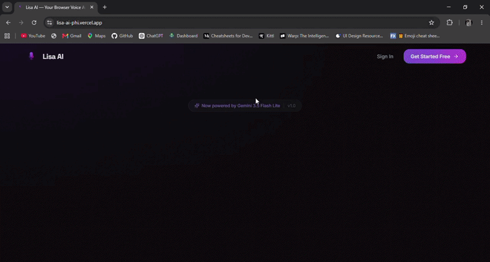

# Lisa AI — Browser Voice Assistant

A browser-based AI voice assistant built as a **Full Stack University Internship Project**. Lisa AI enables natural voice conversations using Google Gemini for intelligent responses and ElevenLabs for realistic speech synthesis, with a browser Text-to-Speech fallback.

[](https://lisa-ai-byk.netlify.app/)
[](https://github.com/Danyalkhattak/lisa-ai)


---

## Overview

Lisa AI is a modern browser-based voice assistant built with React and Convex. Users can authenticate securely with Clerk, speak naturally using the Web Speech API, receive AI-generated responses from Google Gemini, and hear replies through ElevenLabs or the browser's built-in speech synthesis.

---

## Architecture

Lisa AI is a **single-repository full-stack application**.

* **Frontend:** React + Vite + Tailwind CSS
* **Backend:** Convex Serverless Functions
* **Authentication:** Clerk
* **Database:** Convex Database
* **AI:** Google Gemini
* **Voice:** ElevenLabs + Browser SpeechSynthesis Fallback

```text
Browser (React)
       │
       ▼
Clerk Authentication
       │
       ▼
Convex Backend
       │
       ├── Convex Database
       ├── Google Gemini API
       └── ElevenLabs API
```

---

## Desktop Demo

<p align="center">
  
</p>

## Mobile Demo

<p align="center">
  
</p>

---

## Features

* Voice-controlled AI assistant
* Tap-to-talk voice interaction
* AI-powered conversations using Google Gemini
* Natural voice responses using ElevenLabs
* Browser Text-to-Speech fallback
* Secure authentication with Clerk
* Conversation history stored in Convex Database
* Streaming AI responses for lower latency
* Responsive interface for desktop and mobile
* User settings and preferences

---

## Tech Stack

| Category           | Technology                |
| ------------------ | ------------------------- |
| Frontend           | React, Vite, Tailwind CSS |
| Backend            | Convex                    |
| Authentication     | Clerk                     |
| Database           | Convex Database           |
| AI                 | Google Gemini             |
| Voice              | ElevenLabs                |
| Speech Recognition | Web Speech API            |
| Animations         | Framer Motion             |

---

## Project Structure

```text
lisa-ai/
│
├── convex/
│   ├── ai.ts
│   ├── auth.ts
│   ├── clerkWebhook.ts
│   ├── conversations.ts
│   ├── http.ts
│   ├── messages.ts
│   ├── schema.ts
│   ├── tts.ts
│   ├── userSettings.ts
│   └── users.ts
│
├── public/
│   ├── demo-desktop.gif
│   ├── demo-mobile.gif
│   └── favicon.png
│
├── src/
│   ├── components/
│   ├── pages/
│   ├── providers/
│   ├── App.jsx
│   └── main.jsx
│
├── docs/
│   └── lisa-ai.postman_collection.json
│
├── .env.example
├── package.json
└── README.md
```

---

## Installation

Clone the repository.

```bash
git clone https://github.com/Danyalkhattak/lisa-ai.git

cd lisa-ai
```

Install dependencies.

```bash
npm install
```

Copy the environment file.

```bash
cp .env.example .env.local
```

Start the frontend.

```bash
npm run dev
```

Start the Convex backend in another terminal.

```bash
npm run convex:dev
```

Open:

```text
http://localhost:5173
```

---

## Environment Variables

```env
# Clerk
VITE_PUBLIC_CLERK_PUBLISHABLE_KEY=
CLERK_SECRET_KEY=
CLERK_JWT_ISSUER_DOMAIN=

# Google Gemini
GEMINI_API_KEY=

# Convex (generated automatically)
CONVEX_DEPLOYMENT=
VITE_CONVEX_URL=
VITE_CONVEX_SITE_URL=

# Optional
ELEVENLABS_API_KEY=
CLERK_WEBHOOK_SECRET=
```

Configure backend secrets with Convex:

```bash
npx convex env set GEMINI_API_KEY your_key
npx convex env set CLERK_SECRET_KEY your_key
npx convex env set CLERK_JWT_ISSUER_DOMAIN https://your-app.clerk.accounts.dev
npx convex env set ELEVENLABS_API_KEY your_key
npx convex env set CLERK_WEBHOOK_SECRET whsec_xxx
```

---

## Database Setup

Lisa AI uses **Convex Database**, so there is no separate database server to configure.

Database schema is located in:

```text
convex/schema.ts
```

Collections:

| Collection    | Description                           |
| ------------- | ------------------------------------- |
| users         | User profiles synchronized from Clerk |
| conversations | User conversations                    |
| messages      | Conversation messages                 |
| userSettings  | Voice and application preferences     |

Initialize the backend:

```bash
npm run convex:dev
```

Convex automatically:

* Creates a development deployment
* Applies the database schema
* Generates environment variables
* Synchronizes backend functions

---

## API Documentation

Most frontend communication occurs through the Convex React SDK using:

* `useQuery()`
* `useMutation()`
* `useAction()`

Lisa AI also exposes HTTP endpoints for streaming.

### Base URL

```text
https://<your-project>.convex.site
```

### Endpoints

| Method | Endpoint         | Description                  |
| ------ | ---------------- | ---------------------------- |
| POST   | `/chat-stream`   | Streams AI responses         |
| POST   | `/tts-stream`    | Streams ElevenLabs MP3 audio |
| POST   | `/clerk-webhook` | Synchronizes Clerk users     |

### Chat Stream

**Request**

```http
POST /chat-stream
Authorization: Bearer <Clerk JWT>
Content-Type: application/json
```

```json
{
  "conversationId": "conversation_id",
  "message": "Hello Lisa"
}
```

### TTS Stream

**Request**

```http
POST /tts-stream
Authorization: Bearer <Clerk JWT>
Content-Type: application/json
```

```json
{
  "text": "Hello from Lisa"
}
```

### Postman Collection

A ready-to-import Postman collection is included:

```text
docs/lisa-ai.postman_collection.json
```

---

## Application Flow

```text
User
   │
   ▼
Tap Microphone
   │
   ▼
Speech Recognition
   │
   ▼
Convex Backend
   │
   ▼
Google Gemini
   │
   ▼
Conversation Saved
   │
   ▼
ElevenLabs
   │
   ▼
Voice Response
```

---

## Routes

| Route       | Description          |
| ----------- | -------------------- |
| `/`         | Landing Page         |
| `/signin`   | Sign In              |
| `/signup`   | Sign Up              |
| `/call`     | Main Voice Assistant |
| `/settings` | User Settings        |

---

## Build & Deployment

Create a production build.

```bash
npm run build
```

Preview the production build.

```bash
npm run preview
```

Deploy the frontend to Netlify or Vercel.

Deploy the backend:

```bash
npx convex deploy
```

---

## Screenshots & Demo

The repository includes:

* Desktop demonstration GIF
* Mobile demonstration GIF

These demonstrate:

* Authentication
* Voice interaction
* AI conversations
* Voice responses
* Responsive interface

---

## Proposal Compliance

| Proposed Feature                 | Status | Implementation                         |
| -------------------------------- | :----: | -------------------------------------- |
| User authentication              |    ✅   | Clerk Authentication                   |
| Voice input & AI voice responses |    ✅   | Web Speech API + ElevenLabs            |
| AI question answering            |    ✅   | Google Gemini                          |
| Conversation history             |    ✅   | Convex Database                        |
| React–Convex integration         |    ✅   | `useQuery`, `useMutation`, `useAction` |
| Convex backend & database        |    ✅   | Convex Serverless Functions            |
| Email & Weather Check            |    ❌   | Gemini was not calling the Convex functions reliably |
---

## What I Learned

* Building a full-stack application with React and Convex
* Implementing secure authentication using Clerk
* Integrating Google Gemini for AI-powered conversations
* Streaming responses for improved user experience
* Implementing realistic text-to-speech with ElevenLabs
* Working with the Web Speech API
* Managing application state for voice interactions
* Designing responsive user interfaces

---

## License

This project is licensed under the MIT License.
